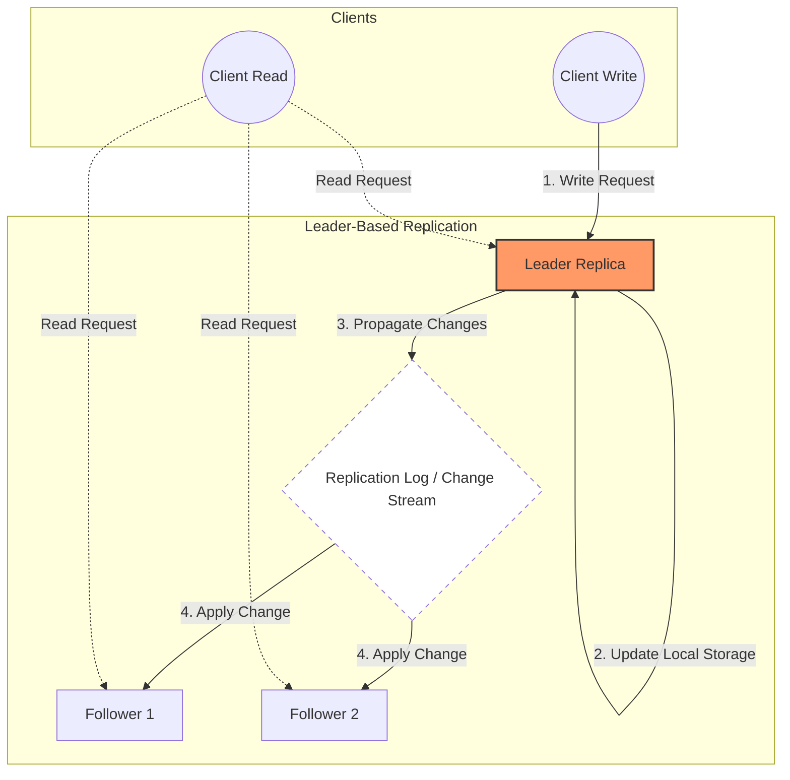

# Leaders and Followers

- Replica: each node that stores a copy of the database
  - With replicas the question is: how do we ensure the data ends up in all replicas?
    - the most common solution for this is the `leader-based replication` (aka, active/passive or master/slave)

```
replica 1:
    - user: 123
        [write operations] -> needs to be propagated
    - name: "John" -> change to "John Doe"
    - profile_pic: "hey_mom.png" -> changed to "cat_photo.png"

replica 2:  -> eventually this replica will need to have the updated data
    - user: 123
    - name: "John"
    - profile_pic: "hey_mom.png"
```

- **Every write to the db needs to be processed by every replica**

## Leader-Follower Replication

1. One of the replicas is designated as the leader (master/primary)
2. When clients want to write to the db, they send the request to the leader
3. Other replicas are the followers (read replicats/slaves/secondaries)
4. Followers receive the changes from the leader through the replication log (change stream)
5. Followers update their data based on the message from the leader
6. When a client wants to read from a db, it can use either the leader or a follower



> Writes are only accepted by the leader, reads can be handled by any replica.

### Sync vs Async

- Does the replication happen sync or async?
  - Sync: leader waits for confirmation of given follower(s) before reporting success to the user and before making write visible to other clients
    - due to the con, it's impractical for all followers to be sync, otherwise one node down, it'd bring the system to a halt
      - it usually means that one of the followers is sync, all the others async
      - if this sync follower becomes unavailable/slow, another async follower becomes sync
      - this allows you to have at least two nodes with up-to-date data (leader / follower(sync))
        - this config is sometimes called semi-synchronous
    - pros:
      - follower is up-to-date with the leader
    - cons:
      - if follower doesn't response (crashed/network fault/etc) the write can't be processed

```
            leader
              |
         follower (sync)
        /           \
follower (async)    follower (async)
```

- Async: leader sends the message, but it doesn't wait for confirmation

- Usually replication happens within 1 or some seconds, however, it's difficult to know how much time there will be until full replication

### Setting up new followers

- Sometimes you need to set up new followers (increase N replicates/replace failed nodes). So, how do we ensure a new follower has an accurate copy of the leader's data?
  - Ideally, we do this without downtime/blocking writes to the leader
  - We should keep in mind that data is always in flux, so copying the file might not be enough

1. Take a snapshot of the leader's db at some point in time
   - ideally without locking the leader's db to writes
2. Copy snapshot to new follower
3. Follower connects to the leader and requests all the data changes that have happened since the snapshot was taken
4. Follower processes the changes that have happened since snapshot (it has `caught up`)
   - it can now process data changes from the leader as they happen

### Handling node outages

- Being able to reboot notes without system downtime is extremely important
  - improved operations and maintenance

Goal:

1. keep system running, even though some nodes might be down
2. keep blast radius of node outage as small as possible

**How do we achieve high availability with leader-based replication?**

#### Follower failure: Catch up recovery

#### Leader failure
