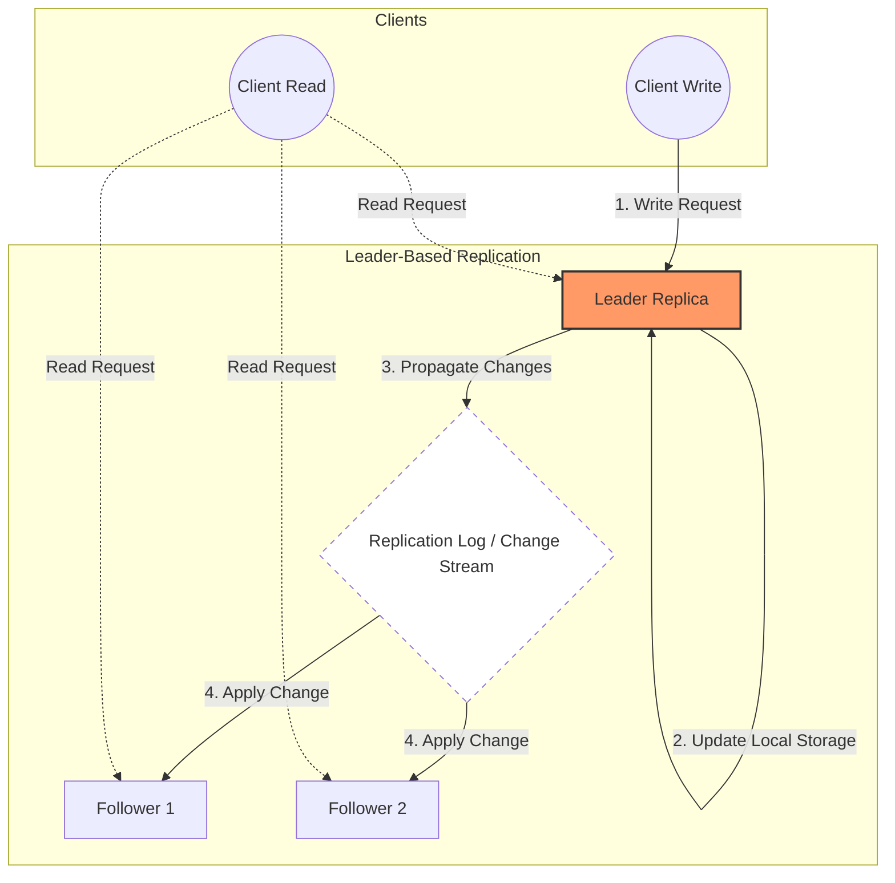

# Leaders and Followers

- Replica: each node that stores a copy of the database
  - With replicas the question is: how do we ensure the data ends up in all replicas?
    - the most common solution for this is the `leader-based replication` (aka, active/passive or master/slave)

```
replica 1:
    - user: 123
        [write operations] -> needs to be propagated
    - name: "John" -> change to "John Doe"
    - profile_pic: "hey_mom.png" -> changed to "cat_photo.png"

replica 2:  -> eventually this replica will need to have the updated data
    - user: 123
    - name: "John"
    - profile_pic: "hey_mom.png"
```

- **Every write to the db needs to be processed by every replica**

## Leader-Follower Replication

1. One of the replicas is designated as the leader (master/primary)
2. When clients want to write to the db, they send the request to the leader
3. Other replicas are the followers (read replicats/slaves/secondaries)
4. Followers receive the changes from the leader through the replication log (change stream)
5. Followers update their data based on the message from the leader
6. When a client wants to read from a db, it can use either the leader or a follower



> Writes are only accepted by the leader, reads can be handled by any replica.

### Sync vs Async

- Does the replication happen sync or async?
  - Sync: leader waits for confirmation of given follower(s) before reporting success to the user and before making write visible to other clients
    - due to the con, it's impractical for all followers to be sync, otherwise one node down, it'd bring the system to a halt
      - it usually means that one of the followers is sync, all the others async
      - if this sync follower becomes unavailable/slow, another async follower becomes sync
      - this allows you to have at least two nodes with up-to-date data (leader / follower(sync))
        - this config is sometimes called semi-synchronous
    - pros:
      - follower is up-to-date with the leader
    - cons:
      - if follower doesn't response (crashed/network fault/etc) the write can't be processed

```
            leader
              |
         follower (sync)
        /           \
follower (async)    follower (async)
```

- Async: leader sends the message, but it doesn't wait for confirmation

- Usually replication happens within 1 or some seconds, however, it's difficult to know how much time there will be until full replication

### Setting up new followers

- Sometimes you need to set up new followers (increase N replicates/replace failed nodes). So, how do we ensure a new follower has an accurate copy of the leader's data?
  - Ideally, we do this without downtime/blocking writes to the leader
  - We should keep in mind that data is always in flux, so copying the file might not be enough

1. Take a snapshot of the leader's db at some point in time
   - ideally without locking the leader's db to writes
2. Copy snapshot to new follower
3. Follower connects to the leader and requests all the data changes that have happened since the snapshot was taken
4. Follower processes the changes that have happened since snapshot (it has `caught up`)
   - it can now process data changes from the leader as they happen

### Handling node outages

- Being able to reboot notes without system downtime is extremely important
  - improved operations and maintenance

Goal:

1. keep system running, even though some nodes might be down
2. keep blast radius of node outage as small as possible

**How do we achieve high availability with leader-based replication?**

#### Follower failure: Catch up recovery

- On its local disk, each follower keeps a log of the data changes it's received from the leader
- If a disconnection happened (follower crashed and restarted / network between leader and follower is temporarily interrupted) the follower uses this log to recover
  - It knows the last transaction it received from the leader through this log
  - It requests all the data from the leader up to the last log entry
  - When it applied all the changes (lastEntryLog + updatedChangesLeader), it has caught up and can continue receiving the stream of data

#### Leader failure: Failover

- This is trickier:

1. One of the followers need to be promoted to new leader
2. Clients need to be reconfigured to send their writes to new leader
3. Other followers need to start consuming data changes from the new leader

This process is called failover. It can be either manual or automatic

##### Automatic failover

1. Determining the leader has failed

- Many things can go wrong:
  - crashes
  - power outages
  - network issues and more

So normally, we use a timeout. If a node doesn't respond for 30s, it's assumed to be dead

2. Choosing a new leader

- Democratic: It can be done through an election, where the followers elect a new leader
- Dictatorship: A node appointed by a previously elected controlled node

> The best candidate is the replica with the most up-to-date changes from the old leader, to minimize data loss

3. Reconfiguring the system to use the new leader

- Clients need to write to the new leader
- If old leader comes back, it needs to recognize the new leader

##### What can go wrong with failover?

1. If async replication, new leader might not have all the writes

- If former leader rejoins after a new leader is elected, what should happen to the writes?
- Most common solution is for the old leaders unreplicated writes to be discarded, which may violate durability principles
- Discarding writes can be really dangerous, especially if other storage systems outside of the db need to be coordinated with the db
  - e.g., Github incident when a out-of-date follower was promoted to leader. The db used an autoincrement counter to assign primary keys to new rows
    - However, since this new leader's counter lagged behind the old leader's, it reused pks from the previous leader
    - These pks were also used in a Redis store, so this reuse of pks resulted in inconsistencies between the db and redis. This caused private data to be disclosed to wrong users

2. In some scenarios, two nodes might believe they are the leader. Known as **split brain**

- Most common solution is to shut down one of the nodes if both think they're the leader
- This needs to be done carefully though, otherwise both nodes might be shut down

3. What's the right time for the timeout to identify the leader as dead?

- If longer, it means a longer recovery time in case the leader fails
- If shorter, it means unnecessary failovers
  - If a network issue happened, or increased traffic, in a system that is already suffering from high load/network problems, unnecessary failovers make this situation worse, not better
- For this reason, some teams prefer to perform failovers manually, even if the software supports automatic ones

> These issues: node failures, unreliable networks, and trade-offs around replica consistency, availability and latency are, in fact, fundamental problems in distributed systems

## Implementation of Replication Logs

How does leader-based replication work under the hood? There are several different methods

1. Statement-based replication
2. Write-ahead log (WAL) shipping
3. Logical (row-based) log replication
4. Trigger-based replication

### 1. Statement-based replication

- Leader logs every write request (statement) that it executes and sends the statement to the followers
  - "I've written, here is what I've written"

- Every INSERT, UPDATE, DELETE statement is forwarded to followers and each follower executes the SQL statement as if it'd been received from the client

- Even though it's a reasonable approach, due to so many edge cases, other replication methods are now preferred
  - By default, MySQL swtiches to row-based replication if any non-deterministic statement is found

#### Issues with statement-based one

- What if a non-deterministic function (`NOW()` or `RAND()`) is called? This would generate a different value on each replica
  - Possible solution: leader substitutes any non-deterministic function with a fixed return value when the statement is logged
- What if the order of executions matter on each replica? e.g. autoincrementing or statement depends on data existing on the db?
- What if some side-effect is present? This might result in this side-effect triggering differently on each replica

### 2. Write-ahead log (WAL) shipping

- Previously, we've seen how storage engines represent data on disk and we've seen they usually append every write to a log
  - Log is an append-only sequence of bytes containing all writes to the db
  - We can use this logic for the replication. Instead of just writing the log to disk, the leader also sends it across the network to its followers

- This method of replication, WAL, is used in PostgreSQL, Oracle, among others

#### Issues with WAL replication

- Couples replication with the storage engine, since the log describes the data on a very low level (saying which bytes were changed in which disk blocks)
  - This can make the leader and follower incompatible if they have different db versions, if the db changes its storage format from one version to another

### 3. Logical (row-based) log replication

- Alternative is to use different log formats for replication for storage engine, which allows replication log to be decoupled from the storage engine internals
- This is called logical log, since it distinguishes the necessary data (logical) from the store engine's (physical) data representation

INSERT: Contains the new values for all columns
DELETE: Enough info to identify which row was deleted (usually the pk)
UPDATE: Enough info to identify which row was updated and the new values of all columns (or at least the columns that were changed)

- Since it decouples the logical and physical replication data, it allows for better backward-compatibility, allowing leader and followers to run different db versions, or even storage engines

### 4. Trigger-based replication

- Replication approaches above are all implemented in the db system, without application code. Most of the cases, that's what we want, but in some cases more flexibility is needed
- Trigger lets us register custom application code that is executed on given data change (write transaction)
- This approach has greater overhead than other replication methods, and is more prone to bugs and limitations than the db's built-in replication methods. However, in some circumstances it might be useful
