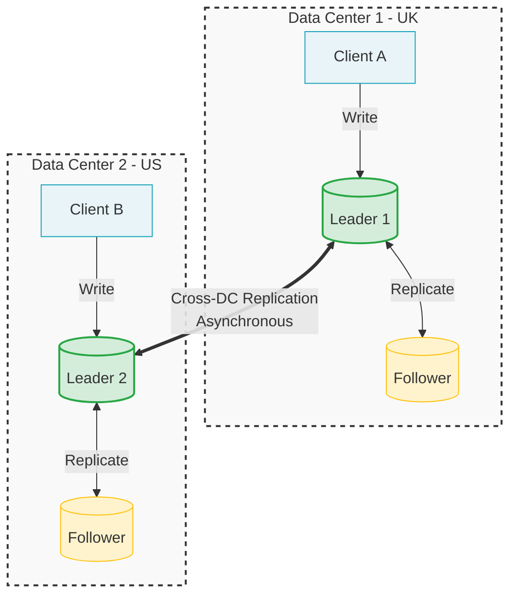

# Multi-leader replication

- Single-leader is a common approach, however...

What's a problem with a single leader-based application?

- if you can't connect to this leader, since all writes pass through it, you can't write to the db

How to solve it?

- a simple extension of this approach is to allow more than one node to accept writes
  - replication remains equal
  - this is a multi-leader configutation (akak master-master or active/active)
  - in this setup, each leader acts as a follower to the other leaders

## Use cases for multi-leader replication

When to have a multi-leader setup?

### 1. Multi-datacenter operation

If you have a db with replicas in different datacenters, each datacenter can have its leader

- why would you have replicas in different datacenters?
  1. tolerate failure of the entire datacenter
  2. be closer to the users

Within each data center, regular leader-follower replication is used

- between datacenters, each leader replicats its changes to the leaders in other datacenters

| Feature                         | Single-leader                                                                                       | Multi-leader                                                                                  |
| ------------------------------- | --------------------------------------------------------------------------------------------------- | --------------------------------------------------------------------------------------------- |
| Performance                     | All writes must travel to the same db. It slows down the process                                    | Every write can be processed in the local db and replicated async. Faster                     |
| Tolerance of datacenter outages | If datacenter with leader fials, failover promotes a leader in another datacenter                   | Each datacenter can continue operating independently. Replication catches up when back online |
| Tolerance of network problems   | Since inter-data center link is done sync, single-leader is more sensitive to errors in the network | With async replication, dealing with temp network failure is easier                           |

We can see that multi-leader replication has advantages:

- performance
- fault tolerance

However, it has a big downside

- **the data may be modified at two different places at the same time. Therefore, the data might conflict**

For this, multi-leader replication is often considered dangerous territory that should be avoided if possible

### 2. Clients with offline operations

Another case that multi-leader can be helpful is if you have an application that should continue working offline

E.g: calendar apps. You need to be able to `____` even offline

- see your evennts
- enter new event

These operations should be available at any time. Mutations should be synced when back online

In this case, **every device has a local db** that acts as a leader (it accepts write requests) and there's async multi-leader replication (sync) between the replicas of your calendar on all your devices

- each device is a datacenter

### 3. Collaborative editing
