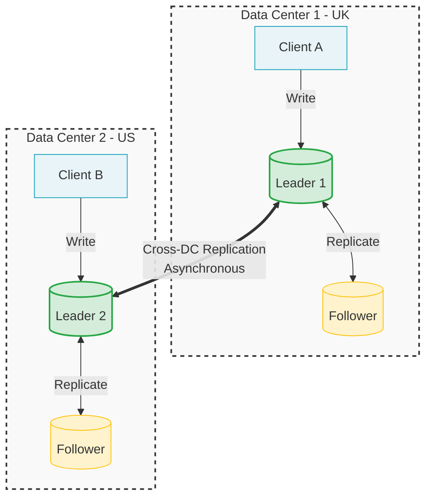
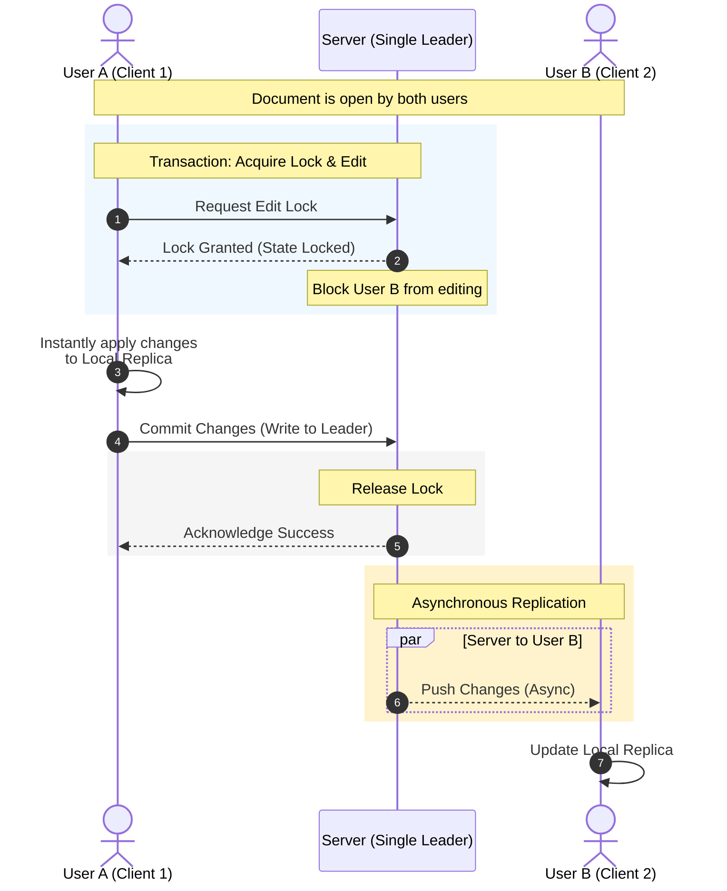

# Multi-leader replication

- Single-leader is a common approach, however...

What's a problem with a single leader-based application?

- if you can't connect to this leader, since all writes pass through it, you can't write to the db

How to solve it?

- a simple extension of this approach is to allow more than one node to accept writes
  - replication remains equal
  - this is a multi-leader configutation (akak master-master or active/active)
  - in this setup, each leader acts as a follower to the other leaders

## Use cases for multi-leader replication

When to have a multi-leader setup?

### 1. Multi-datacenter operation

If you have a db with replicas in different datacenters, each datacenter can have its leader

- why would you have replicas in different datacenters?
  1. tolerate failure of the entire datacenter
  2. be closer to the users

Within each data center, regular leader-follower replication is used

- between datacenters, each leader replicats its changes to the leaders in other datacenters

| Feature                         | Single-leader                                                                                       | Multi-leader                                                                                  |
| ------------------------------- | --------------------------------------------------------------------------------------------------- | --------------------------------------------------------------------------------------------- |
| Performance                     | All writes must travel to the same db. It slows down the process                                    | Every write can be processed in the local db and replicated async. Faster                     |
| Tolerance of datacenter outages | If datacenter with leader fials, failover promotes a leader in another datacenter                   | Each datacenter can continue operating independently. Replication catches up when back online |
| Tolerance of network problems   | Since inter-data center link is done sync, single-leader is more sensitive to errors in the network | With async replication, dealing with temp network failure is easier                           |

We can see that multi-leader replication has advantages:

- performance
- fault tolerance

However, it has a big downside

- **the data may be modified at two different places at the same time. Therefore, the data might conflict**

For this, multi-leader replication is often considered dangerous territory that should be avoided if possible

### 2. Clients with offline operations

Another case that multi-leader can be helpful is if you have an application that should continue working offline

E.g: calendar apps. You need to be able to `____` even offline

- see your evennts
- enter new event

These operations should be available at any time. Mutations should be synced when back online

In this case, **every device has a local db** that acts as a leader (it accepts write requests) and there's async multi-leader replication (sync) between the replicas of your calendar on all your devices

- each device is a datacenter

### 3. Collaborative editing

When a user modifies a document, the changes are instantly applied to their local replica (the state of the document in their web browser or client application) and async replicated to the server and any other user who's also editing the same document

- To guarantee that there'll be no editing conflicts, we must "lock" the state before another user can edit it
- This collaboration model is equivalent to single-leader replication with transactions on the leader

## Handling write conflicts

Let's say:

1. user 1: modifies title from A to B
2. user 2: modifies title from A to C

What now?

- each change is correctly applied to the local leader
- however, when changes are async propagated, a conflict happens

### Sync vs. async conflict detection

To avoid this, we could make the conflict detection sync (wait for the write to be replicated to ALL replicats to inform the user that the write was successful)

- but this isn't very good
- then, we'd lose the main advantage of multi-leader replication -> **allowing each replica to accept writes independently**

**If you want sync conflict detection, you might as well just keep with single-leader replication**

### Conflict avoidance

The simplest strategy to deal with conflict is to avoid them. How?

- **Make the writes for a particular record go through the same leader**
- This is usually the recommend approach. Each leader has a "specialty" or "department"

If a user can modify his own data, ensure the requests for that particular user are always routed to the same datacenter and use the leader in that datacenter for reading and writing

- Different users can have different "home" datacenters (e.g. picked by geographic proximity)
- from any user's point of view the whole thing is single-leader

Issues with this:

- what if a given datacenter fails and you need to reroute traffic to another datacenter?
- what if the user moved out to a different location and is now closer to another datacenter?

### Convergence toward a consistent state

- Single-leader, as a sync process, the final value is the final operation
- Multi-leader, as an async process, there's no defined ordering of writes, so it's not clear what the final value should be

How to deal with this inconsistent states?

1. give each write a unique ID (e.g. timestapm, random long num, uuid, hash of key and value)

- pick the write with the highest id as the winner and throw away all the other writes
- if timestamp is used, this technique is known as last write wins (LWW)
  - popular, but prone to data loss

2. give each replica a unique ID and let writes that originated at a higher-numbered replica take precedence over writes from lower-numbered ones

- also prone to data loss

3. somehow merge the values together

4. record the conflict in an explicit data structure that preserves all the info and write application code that resolves the conflict later (e.g. prompting the user)

### Custom conflict resolution logic

The most appropriate way of resolving a conflict may depend on the application, so most multi-leader replication tools let you write conflict resolution logic using application code.

- This code may be executed on write or read
